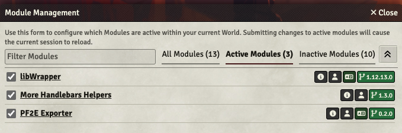
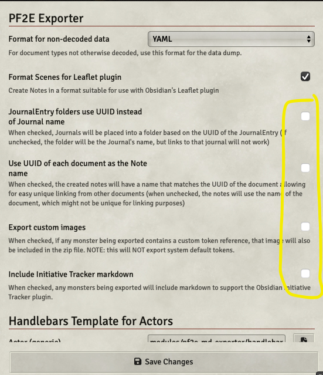

# PF2E Exporter Process Overview

**NOTE** This the Foundry V12 beta branch.

> [!CAUTION] 
> This is a modification of the [Markdown Exporter](https://github.com/farling42/fvtt-export-markdown) module.   It was modified so it produces more usable Pathfinder 2E Remaster content in markdown format for Obisidian.  Since it is a derivative of the Markdown Exporter module, it is important to know you should not have both modules active at the same time in a single world.  They both modify menus in the same way, so will very likely cause confusing behavior.

This module relies on [handlebars](https://handlebarsjs.com) to do the data conversion to markdown format.  When exporting the Pathfinder data, the module will use the included `handlebars/spell_handlebar.hbs` for Spells, `monster_handlebar.hbs` as the general handlebar for Actors, `hazard_handlebar.hbs` as the handlebar for Hazard actors, and `generic_handlebar.hbs` for generic items.  These handlebars will already be selected by default in the module settings, but you can override them if you have your own custom handlebars.

Also included in this project is a `pf2e-spell.css` which is an 
Obsidian CSS snippet which can be installed in your `.obsidian/snippets` directory so the spells resemble the new style used in the Player Core and GM Core books.

# Detailed Installation Instructions

This process requires you have a Foundry account with a World with the **Pathfinder Second Edition** package selected as the Game System.

## 1. Install the following required modules:
* **PF2E Exporter** (This is what you are reading right now. Use manifest `https://raw.githubusercontent.com/MostTornBrain/pf2e-md-exporter/feature/v12-support/moduleV12.json`)
* **libWrapper**
* **More Handlebars Helpers**

NOTE: You should be prompted to install the two extra required modules automatically when installing this module. 

## 2. Enable modules
Launch your world in Foundry and log in as the Gamemaster account.   

Choose `Manage Modules` in your logged into Foundry world.  Enable these three modules you installed in step 1. 

## 3. Configure PF2E Exporter
Choose `Configure Settings` and pick PF2E Exporter.

_NOTE:_ It is recommended to **NOT** use the UUID of each document as the note name as doing so will populate your vault with a lot of random file names.

- If you own any custom modules that supply monster artwork and you want that artwork to be included, you must enable such modules in your world, and select the option to "Export custom images".

- If you want to include markdown for the monsters for Obsidian's [Initiative Tracker](https://github.com/javalent/initiative-tracker) plugin, choose "Include Initiative Tracker markdown".

Click on `Save Changes`.

## 4. Export the Compendium
You are now ready to export any items from your world, including Pathfinder Compendium items.  If you want to do a quick test, choose to view a monster or spell, then choose to "import" it into your saved items.   Then, right click on that item and choose the last option in the pop-up menu named `Export to Markdown`. If everything is installed correctly, you should see a pop-up message saying it is exporting the data and then a file will be saved named after the item. If the file has multiple items associated with it will be created as a `.zip` file.

If you want to export the whole Compendium, you can go to the compendium menu and at the bottom of the screen choose `Export to Markdown`.  This will take several minutes.  If you'd like to see progress as you wait, you can open the browser debug window and the console will show messages of the items it is exporting.

## 6. Customize your Vault
The exported data requires a couple extra plugins in Obsidian to be viewed in the best format.
### Install and enable the following plugins:
* **Fantasy Statblocks**
* **Pathfinder 2E Action Icons**

For the Fantasy Statblocks, you can go into its settings and disable the built-in D&D 5e SRD monsters if you aren't using D&D.

### Install ITS
It is also recommended to install the ITS Theme so the spells look their best. Choose Obsidian Settings, `Appearance` and in the `Themes` section pick manage, search for ITS and install and use it.

> [!NOTE]
> If you install ITS, it is also recommended to install the [Style Settings](https://github.com/mgmeyers/obsidian-style-settings) plugin, which allows you to customize the look of ITS.  Specifically, you will likely want to disable the rendering of statblocks by ITS as it conflicts with Fantasy Statblocks.  This can be done via the Style Settings->Plugins->"Disable ITS Styled Statblocks" option.
> 

### Install the custom CSS snippet for spells
In addition, copy the `pf2e-spell.css` from this github project into your `.obsidian/snippets` folder.  (If you don't already have a snippets folder, you will need to create it.)   After you copy the snippet file, go into the Obsidian settings, choose `Appearance` and scroll down to the `Snippets` section and enable this `pf2e-spell.css` snippet.

### Unzip the exported Compendium and add it to your vault.
You can install the compendium in any sub-folder in your vault.  If you used the default export option of NOT using UUID names for documents, the links created in the exported documents will use shortened paths based on the document type (such as spell, or feat, etc), so you should be able to even re-organize the directories however you might prefer.  While you can change where you store the directories containing each category of document, it should be noted that you should NOT rename the directories themselves since the links rely on the directory names.  For example, you can move the Spells folder whereever you'd like, but if you renamed folder "Spells" to "PF2E Spells" that would break many links in the documents.

If you instead chose the option to export the documents as UUID names, the above restrictions do not apply. You can move any individual document anywhere and the links will still work properly.

### Reload Obsisian so the plugin and CSS changes take effect
At this point, it is recommended to reload Obsidian to ensure all the plugins and theme changes take effect, although it may not be 100% necessary in all cases.

## Enjoy!
At this point, you should have a vault with the compendium of fully linked files.  Monsters should look like this:

And spells should look like this:

# TODO

## Currently in process:
* spot checking the data for Spells, Monsters, Hazards, ACtions, Feats, and Weapons comparing to the published PDFs to ensure the handlebars are not missing important data for the export.

## Future:
Better conversion for the rest of the document types, such as Glossary, remaining equipment (to include cost, weight, etc.).
